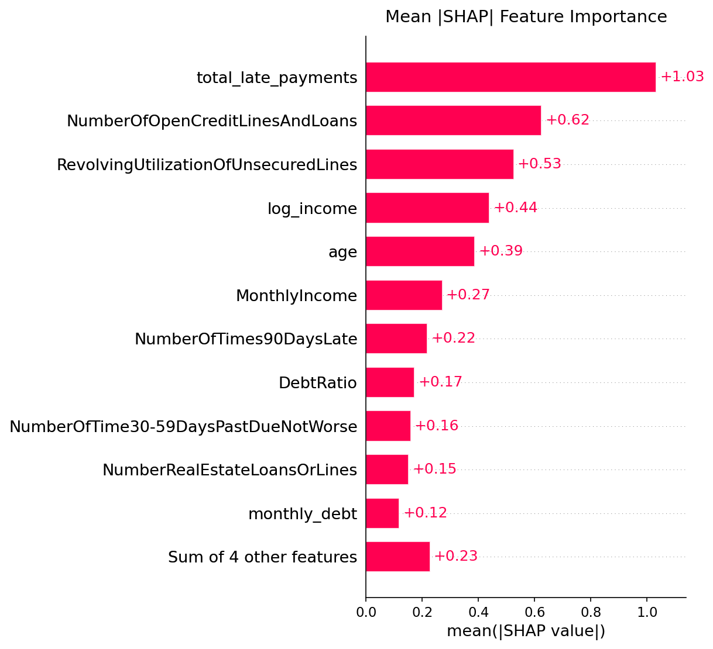
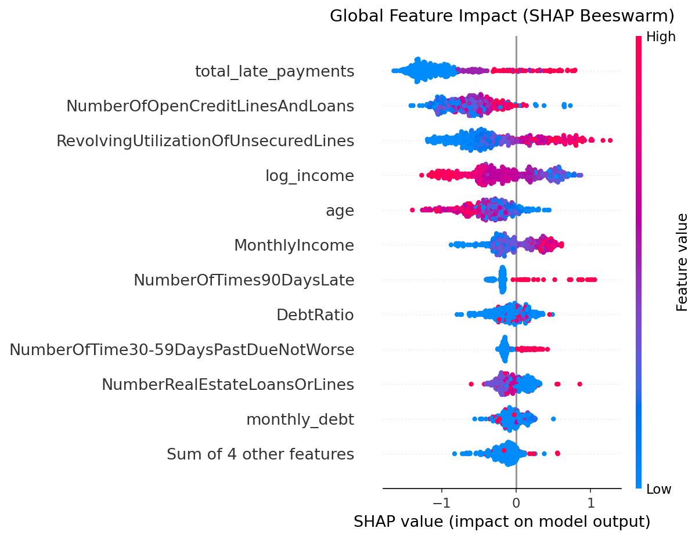
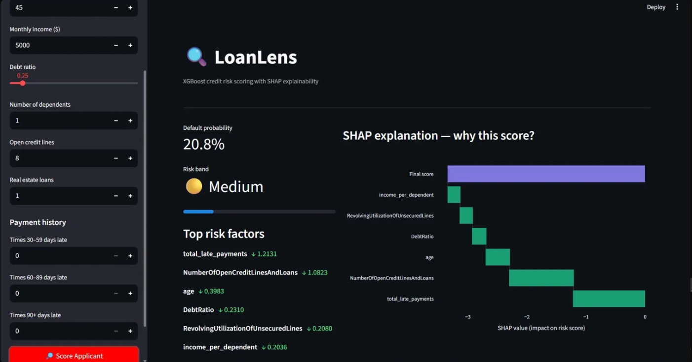
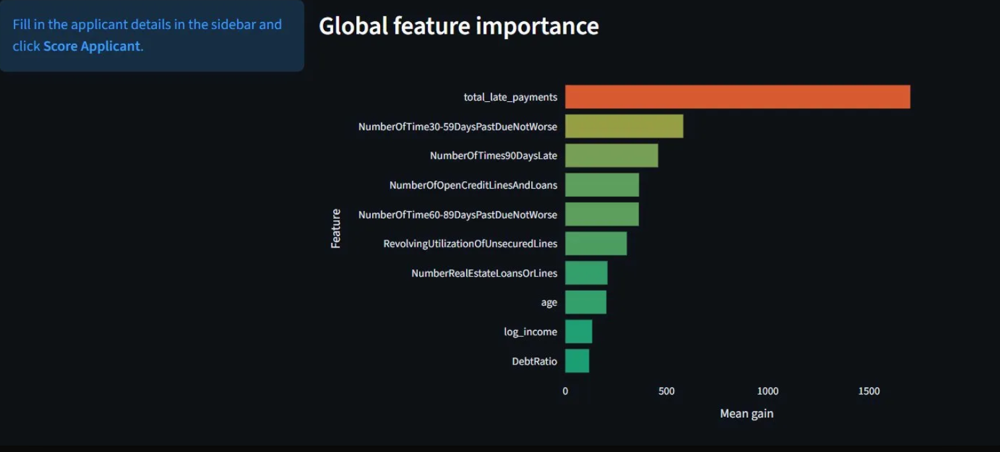

#  LoanLens — Credit Risk Scoring Engine

An end-to-end credit risk assessment system powered by **XGBoost** with **SHAP explainability**, served through a **FastAPI** REST API and visualized via an interactive **Streamlit** dashboard.

Built to demonstrate how modern ML pipelines can deliver **transparent, auditable, and real-time** credit decisions — the kind that fintech compliance teams actually need.

---

##  Problem Statement

Traditional credit scoring treats models as black boxes. Lenders get a number but no explanation. Regulators demand transparency. Borrowers deserve to know *why* they were declined.

LoanLens solves this by pairing a high-performance XGBoost classifier with per-prediction SHAP explanations, exposing not just *what* the risk score is, but *which factors* drove it up or down.

---

##  Model Performance

Trained on **150,000 borrower records** from the Kaggle [Give Me Some Credit](https://www.kaggle.com/c/GiveMeSomeCredit/data) dataset, with only **~7% default rate** (severe class imbalance).

| Metric | Score |
|---|---|
| **AUC-ROC** | 0.87+ |
| **Average Precision** | 0.72+ |
| **Class Balancing** | SMOTE oversampling |
| **Early Stopping** | 30 rounds, 15% validation hold-out |

### Risk Bands

The model maps raw probabilities to interpretable risk bands:

| Probability | Band |
|---|---|
| < 10% | 🟢 Very Low |
| 10–20% | 🟢 Low |
| 20–35% | 🟡 Medium |
| 35–55% | 🔴 High |
| > 55% | 🔴 Very High |

---

##  SHAP Explainability

Every prediction returns the **top 6 features** that influenced that specific score, with direction and magnitude — not just global importances.

### Global Feature Importance

The SHAP bar chart reveals which features matter most across all predictions:



**Key Findings:**
- **`total_late_payments`** is by far the strongest predictor (mean |SHAP| = 1.03) — a borrower's payment history dominates risk assessment
- **`NumberOfOpenCreditLinesAndLoans`** (0.62) and **`RevolvingUtilizationOfUnsecuredLines`** (0.53) follow — credit exposure matters
- **`log_income`** (0.44) and **`age`** (0.39) provide meaningful signal about repayment capacity
- Engineered features (`total_late_payments`, `monthly_debt`, `log_income`) outperform several raw inputs

### Feature Impact Distribution

The beeswarm plot shows *how* each feature's values push predictions:



**Insights from the beeswarm:**
- **High `total_late_payments`** (red dots) strongly pushes risk scores right (higher default probability)
- **Low `NumberOfOpenCreditLinesAndLoans`** (blue dots) decreases risk — established credit history is protective
- **High `RevolvingUtilizationOfUnsecuredLines`** increases risk — maxed-out credit lines are a red flag
- **`NumberOfTimes90DaysLate`** shows a clear threshold effect — even one 90+ day late payment dramatically shifts risk

---

##  Architecture

```
┌───────────────────────────────────────────────────────────┐
│                     LoanLens System                       │
│                                                           │
│  ┌─────────────┐     ┌──────────────┐     ┌───────────┐  │
│  │  Streamlit   │────▶│   FastAPI     │────▶│  XGBoost  │  │
│  │  Dashboard   │◀────│   REST API   │◀────│  + SHAP   │  │
│  │  (port 8501) │     │  (port 8000) │     │  Model    │  │
│  └─────────────┘     └──────────────┘     └───────────┘  │
│        │                    │                    │         │
│        │              Pydantic v2            Artifacts     │
│        │              Validation         model.pkl         │
│        │                                 scaler.pkl        │
│     Plotly +                             shap_explainer    │
│     SHAP Charts                          feature_cols      │
└───────────────────────────────────────────────────────────┘
```

### Feature Engineering Pipeline

The preprocessing stage creates **5 engineered features** on top of the 10 raw inputs:

| Engineered Feature | Logic | Rationale |
|---|---|---|
| `total_late_payments` | 30–59 + 60–89 + 90+ days late | Aggregate delinquency signal |
| `monthly_debt` | DebtRatio × MonthlyIncome | Absolute debt burden |
| `income_per_dependent` | Income / (Dependents + 1) | Per-capita financial capacity |
| `log_income` | log(1 + Income) | Reduces skew, stabilizes variance |
| `income_was_missing` | Binary flag | Informative missingness indicator |

---

##  Screenshots

### Dashboard — Scoring Form & SHAP Waterfall



### Dashboard — Global Feature Importance





---

##  Tech Stack

| Layer | Technology |
|---|---|
| Model | XGBoost (early stopping, `scale_pos_weight`) |
| Class Balancing | SMOTE (imblearn) |
| Explainability | SHAP TreeExplainer |
| API | FastAPI + Pydantic v2 |
| Dashboard | Streamlit + Plotly |
| Preprocessing | scikit-learn StandardScaler |
| Container | Docker + Docker Compose |
| Package Manager | [uv](https://docs.astral.sh/uv/) (10–100× faster than pip) |

---

##  Quickstart

### 1. Get the dataset

Download from Kaggle: https://www.kaggle.com/c/GiveMeSomeCredit/data

Place `cs-training.csv` in the `data/` folder.

### 2. Install uv (if not already installed)

```bash
pip install uv
```

### 3. Create and activate a virtual environment

```bash
uv venv

# Linux / macOS
source .venv/bin/activate

# Windows
.venv\Scripts\activate
```

### 4. Install dependencies

```bash
uv pip install -r requirements.txt
```

### 5. Train the model

```bash
cd src
python train.py --data ../data/cs-training.csv --output ../models/
```

This will:
- Engineer features and handle missing values
- Apply SMOTE for class imbalance
- Train XGBoost with early stopping
- Save `model.pkl`, `scaler.pkl`, `feature_cols.pkl`, `shap_explainer.pkl`
- Generate `shap_beeswarm.png` and `shap_bar.png` in `models/`

### 6. Run with Docker

```bash
docker-compose up --build
```

- API: http://localhost:8000
- Dashboard: http://localhost:8501
- API docs: http://localhost:8000/docs

### 7. Run locally (no Docker)

```bash
# Terminal 1 — API
cd api && uvicorn main:app --reload --port 8000

# Terminal 2 — Dashboard
streamlit run dashboard/app.py
```

---

##  API Usage

### POST /predict

```bash
curl -X POST http://localhost:8000/predict \
  -H "Content-Type: application/json" \
  -d '{
    "revolving_utilization": 0.82,
    "age": 38,
    "past_due_30_59": 2,
    "debt_ratio": 0.45,
    "monthly_income": 3500,
    "open_credit_lines": 5,
    "times_90_days_late": 1,
    "real_estate_loans": 0,
    "past_due_60_89": 0,
    "dependents": 2
  }'
```

**Response:**
```json
{
  "probability_of_default": 0.4821,
  "risk_band": "High",
  "base_value": 0.0654,
  "top_factors": [
    {
      "feature": "RevolvingUtilizationOfUnsecuredLines",
      "impact": 0.1823,
      "direction": "increases risk"
    },
    {
      "feature": "age",
      "impact": -0.0912,
      "direction": "decreases risk"
    }
  ]
}
```

### GET /health
### GET /feature-importance

---

##  Project Structure

```
loanlens/
├── data/                    # Raw dataset (not committed)
├── models/                  # Trained artifacts (generated by train.py)
│   ├── model.pkl
│   ├── scaler.pkl
│   ├── feature_cols.pkl
│   ├── shap_explainer.pkl
│   ├── shap_beeswarm.png
│   └── shap_bar.png
├── src/
│   ├── train.py             # Full training pipeline
│   └── preprocess.py        # Feature engineering
├── api/
│   ├── main.py              # FastAPI app
│   ├── schemas.py           # Pydantic request/response models
│   └── model_loader.py      # Artifact loading
├── dashboard/
│   └── app.py               # Streamlit dashboard
├── Dockerfile
├── docker-compose.yml
└── requirements.txt
```

---

##  Key Design Decisions

**SMOTE + scale_pos_weight** — The dataset has only ~7% defaults. SMOTE synthesizes new minority-class examples during training, while `scale_pos_weight` further penalizes misclassifying defaults. This dual approach prevents the model from naively predicting "no default" for every applicant.

**SHAP per prediction** — Every API response includes the top 6 features that drove that specific applicant's score up or down, not just global importances. This mirrors what real fintech compliance teams need for adverse action notices.

**Pydantic v2 validation** — All inputs are type-checked and range-validated before reaching the model. Bad inputs get a 422 with clear error messages — no silent failures.

**Environment-aware API URL** — The dashboard reads `API_URL` from environment variables, defaulting to `localhost:8000` for local development and using Docker service names in container mode.

**uv for dependency management** — Using [uv](https://docs.astral.sh/uv/) instead of pip for 10–100× faster installs and deterministic resolution.

---

